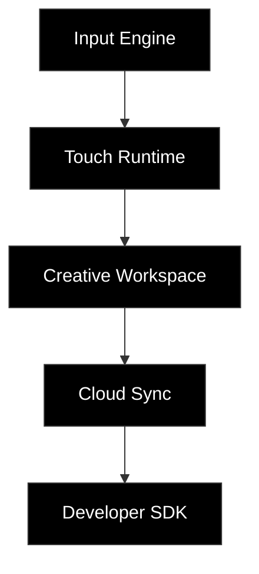

[README.md](https://github.com/user-attachments/files/30066449/README.md)

# UderTouch

**UderTouch is a software platform that transforms existing tablets into purpose-built creative workspaces.**

 

<!-- Recommended Hero Image Dimensions: 1200x630 (Minimalist black background) -->

 

## Philosophy

We believe the most powerful creative tools are already in people's hands.

Every unused tablet deserves another purpose.

UderTouch transforms existing hardware into a new creative platform instead of producing more electronics.

 

## Product

<!-- Replace this list with high-quality, borderless UI mockups -->
- Desktop
- Tablet
- Workspace
- Gesture
- Settings

 

## Platform

 

## Built with

  
  
  
  

 

## Roadmap

**2026**

✓ Product Research  
✓ UX System  
✓ Interaction Engine  
→ Private Alpha  
○ Public Beta  
○ SDK  

  

  
──────────────

  
Designed with purpose.

  
Built for existing devices.

   
  
© UderTouch

